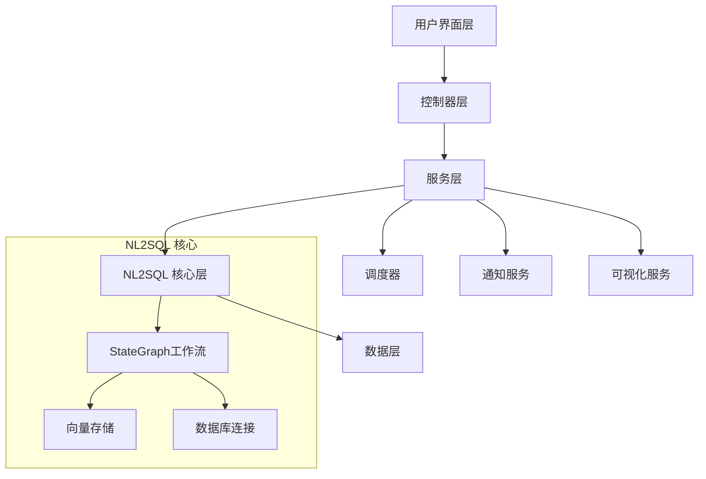

## 基于Spring AI Alibaba NL2SQL的自动化报表系统设计 

基于spring-ai-alibaba的nl2sql模块，设计一个完整的自动化报表系统。

### 系统架构 

系统采用分层架构，核心基于StateGraph工作流引擎。 NL2SQL模块通过多个节点处理自然语言查询：查询重写、关键词提取、Schema召回、表关系分析、SQL生成、SQL验证和语义一致性检查。




### 核心实现要点 

**1. 图表可视化支持**  
系统支持生成PlantUML和Mermaid格式的工作流图表。 您可以通过`getGraph()`方法获取流程图的markdown代码。 

**2. 向量存储配置**  
支持AnalyticDB（生产环境）和SimpleVector（开发测试）两种存储方式。

**3. 数据库连接**  
支持MySQL和PostgreSQL等主流数据库。

### 实际应用示例  

在Spring Ai Alibaba 的BigToolController中可以看到StateGraph的实际使用：系统会自动生成Mermaid格式的工作流图并输出到控制台。

### 图表生成功能  

系统内置了图表表示测试，展示了如何生成不同类型的流程图： 包括并行分支、条件路由等复杂场景的可视化。

这个设计充分利用了Spring AI Alibaba的Graph工作流引擎和NL2SQL能力，为企业提供了一个智能化的报表自动化解决方案，同时支持完整的流程图可视化功能。  

## 业务数据库建表

请见 [spring-ai-alibaba-nl2sql-example](https://github.com/springaialibaba/spring-ai-alibaba-examples/tree/main/spring-ai-alibaba-nl2sql-example/chat/sql)

## 数据库建表语句

### 1. 报表模板表 (report_templates)

```sql
-- 创建报表模板表
CREATE TABLE `report_templates` (
    `id` BIGINT AUTO_INCREMENT PRIMARY KEY COMMENT '主键ID',
    `name` VARCHAR(200) NOT NULL COMMENT '报表名称',
    `description` TEXT COMMENT '报表描述',
    `natural_query` TEXT NOT NULL COMMENT '自然语言查询',
    `cron_expression` VARCHAR(100) COMMENT 'Cron定时表达式',
    `status` VARCHAR(20) NOT NULL DEFAULT 'ACTIVE' COMMENT '状态：ACTIVE, INACTIVE, DELETED',
    `output_format` VARCHAR(50) DEFAULT 'JSON' COMMENT '输出格式：JSON, EXCEL, HTML, PDF',
    `chart_config` TEXT COMMENT '图表配置JSON',
    `notification_config` TEXT COMMENT '通知配置JSON',
    `created_at` TIMESTAMP DEFAULT CURRENT_TIMESTAMP COMMENT '创建时间',
    `updated_at` TIMESTAMP DEFAULT CURRENT_TIMESTAMP ON UPDATE CURRENT_TIMESTAMP COMMENT '更新时间',
    INDEX `idx_status` (`status`),
    INDEX `idx_cron` (`cron_expression`),
    INDEX `idx_created_at` (`created_at`)
) ENGINE=InnoDB DEFAULT CHARSET=utf8mb4 COLLATE=utf8mb4_unicode_ci COMMENT='报表模板表';
```

### 2. 报表执行记录表 (report_executions)

```sql
-- 创建报表执行记录表
CREATE TABLE `report_executions` (
    `id` BIGINT AUTO_INCREMENT PRIMARY KEY COMMENT '主键ID',
    `template_id` BIGINT NOT NULL COMMENT '报表模板ID',
    `status` VARCHAR(20) NOT NULL DEFAULT 'PENDING' COMMENT '执行状态：PENDING, RUNNING, SUCCESS, FAILED, CANCELLED',
    `execution_time` TIMESTAMP DEFAULT CURRENT_TIMESTAMP COMMENT '执行开始时间',
    `completion_time` TIMESTAMP NULL COMMENT '执行完成时间',
    `generated_sql` TEXT COMMENT '生成的SQL语句',
    `result_data` LONGTEXT COMMENT '查询结果数据JSON',
    `error_message` TEXT COMMENT '错误信息',
    `output_file_path` VARCHAR(500) COMMENT '输出文件路径',
    `execution_duration` BIGINT COMMENT '执行时长（毫秒）',
    INDEX `idx_template_id` (`template_id`),
    INDEX `idx_status` (`status`),
    INDEX `idx_execution_time` (`execution_time`),
    FOREIGN KEY (`template_id`) REFERENCES `report_templates`(`id`) ON DELETE CASCADE
) ENGINE=InnoDB DEFAULT CHARSET=utf8mb4 COLLATE=utf8mb4_unicode_ci COMMENT='报表执行记录表';
```

## 模拟数据插入

### 1. 插入报表模板数据

```sql
-- 插入销售报表模板
INSERT INTO `report_templates` (
    `name`, 
    `description`, 
    `natural_query`, 
    `cron_expression`, 
    `status`, 
    `output_format`, 
    `chart_config`, 
    `notification_config`
) VALUES 
(
    '每日销售报表',
    '统计每日销售数据，包括销售额、订单量和热销商品',
    '查询昨天的销售总额、订单数量和热销商品前10名',
    '0 0 9 * * ?',
    'ACTIVE',
    'EXCEL',
    '{"charts":[{"type":"line","title":"销售趋势","xField":"date","yField":"sales_amount"},{"type":"bar","title":"热销商品","xField":"product_name","yField":"quantity"}]}',
    '{"email":{"recipients":["manager@example.com","sales@example.com"],"subject":"每日销售报表 - {{date}}"},"dingtalk":{"enabled":true,"message":"📊 每日销售报表已生成，请查收！"}}'
),
(
    '库存预警报表',
    '监控库存不足的商品，及时预警',
    '查询库存数量小于安全库存的商品信息',
    '0 0 8,18 * * ?',
    'ACTIVE',
    'HTML',
    '{"charts":[{"type":"bar","title":"库存预警","xField":"product_name","yField":"stock_quantity"}]}',
    '{"email":{"recipients":["warehouse@example.com"],"subject":"库存预警报表"}}'
),
(
    '客户分析报表',
    '分析客户购买行为和偏好',
    '查询本月新增客户数量、客户购买频次和客户地域分布',
    '0 0 10 1 * ?',
    'ACTIVE',
    'JSON',
    '{"charts":[{"type":"pie","title":"客户地域分布","xField":"region","yField":"customer_count"}]}',
    '{"email":{"recipients":["marketing@example.com"],"subject":"月度客户分析报表"}}'
),
(
    '财务月报',
    '生成月度财务汇总报表',
    '查询本月总收入、总支出、利润率和各部门费用明细',
    '0 0 9 1 * ?',
    'ACTIVE',
    'PDF',
    '{"charts":[{"type":"line","title":"收支趋势","xField":"month","yField":"amount"}]}',
    '{"email":{"recipients":["finance@example.com","ceo@example.com"],"subject":"月度财务报表"}}'
),
(
    '产品性能报表',
    '分析产品销售性能和用户反馈',
    '查询各产品的销售量、退货率和用户评分',
    NULL,
    'INACTIVE',
    'EXCEL',
    '{"charts":[{"type":"bar","title":"产品销售排行","xField":"product_name","yField":"sales_count"}]}',
    '{"email":{"recipients":["product@example.com"],"subject":"产品性能分析报表"}}'
);
```

### 2. 插入报表执行记录数据

```sql
-- 插入报表执行记录
INSERT INTO `report_executions` (
    `template_id`,
    `status`,
    `execution_time`,
    `completion_time`,
    `generated_sql`,
    `result_data`,
    `error_message`,
    `output_file_path`,
    `execution_duration`
) VALUES 
(
    1,
    'SUCCESS',
    '2024-01-15 09:00:00',
    '2024-01-15 09:02:30',
    'SELECT DATE(order_date) as date, SUM(total_amount) as sales_amount, COUNT(*) as order_count FROM orders WHERE DATE(order_date) = CURDATE() - INTERVAL 1 DAY GROUP BY DATE(order_date)',
    '[{"date":"2024-01-14","sales_amount":125600.50,"order_count":89}]',
    NULL,
    '/data/reports/每日销售报表_20240115_090000.xlsx',
    150000
),
(
    1,
    'SUCCESS',
    '2024-01-16 09:00:00',
    '2024-01-16 09:01:45',
    'SELECT DATE(order_date) as date, SUM(total_amount) as sales_amount, COUNT(*) as order_count FROM orders WHERE DATE(order_date) = CURDATE() - INTERVAL 1 DAY GROUP BY DATE(order_date)',
    '[{"date":"2024-01-15","sales_amount":138900.75,"order_count":102}]',
    NULL,
    '/data/reports/每日销售报表_20240116_090000.xlsx',
    105000
),
(
    2,
    'SUCCESS',
    '2024-01-15 08:00:00',
    '2024-01-15 08:01:20',
    'SELECT product_name, stock_quantity, safety_stock FROM products WHERE stock_quantity < safety_stock',
    '[{"product_name":"iPhone 15","stock_quantity":5,"safety_stock":20},{"product_name":"MacBook Pro","stock_quantity":2,"safety_stock":10}]',
    NULL,
    '/data/reports/库存预警报表_20240115_080000.html',
    80000
),
(
    3,
    'FAILED',
    '2024-01-01 10:00:00',
    '2024-01-01 10:00:30',
    'SELECT region, COUNT(*) as customer_count FROM customers WHERE created_date >= DATE_SUB(CURDATE(), INTERVAL 1 MONTH) GROUP BY region',
    NULL,
    'Table customers doesn\'t exist',
    NULL,
    30000
),
(
    1,
    'RUNNING',
    '2024-01-17 09:00:00',
    NULL,
    'SELECT DATE(order_date) as date, SUM(total_amount) as sales_amount, COUNT(*) as order_count FROM orders WHERE DATE(order_date) = CURDATE() - INTERVAL 1 DAY GROUP BY DATE(order_date)',
    NULL,
    NULL,
    NULL,
    NULL
),
(
    4,
    'SUCCESS',
    '2024-01-01 09:00:00',
    '2024-01-01 09:05:15',
    'SELECT MONTH(transaction_date) as month, SUM(CASE WHEN type=\'income\' THEN amount ELSE 0 END) as income, SUM(CASE WHEN type=\'expense\' THEN amount ELSE 0 END) as expense FROM financial_records WHERE YEAR(transaction_date) = YEAR(CURDATE()) AND MONTH(transaction_date) = MONTH(CURDATE()) - 1 GROUP BY MONTH(transaction_date)',
    '[{"month":12,"income":2500000.00,"expense":1800000.00}]',
    NULL,
    '/data/reports/财务月报_20240101_090000.pdf',
    315000
);
```

### 3. 查询验证数据

```sql
-- 查询所有活跃的报表模板
SELECT id, name, cron_expression, status, created_at 
FROM report_templates 
WHERE status = 'ACTIVE' 
ORDER BY created_at DESC;

-- 查询最近的执行记录
SELECT 
    rt.name as template_name,
    re.status,
    re.execution_time,
    re.completion_time,
    re.execution_duration
FROM report_executions re
JOIN report_templates rt ON re.template_id = rt.id
ORDER BY re.execution_time DESC
LIMIT 10;

-- 查询执行成功率统计
SELECT 
    rt.name as template_name,
    COUNT(*) as total_executions,
    SUM(CASE WHEN re.status = 'SUCCESS' THEN 1 ELSE 0 END) as success_count,
    ROUND(SUM(CASE WHEN re.status = 'SUCCESS' THEN 1 ELSE 0 END) * 100.0 / COUNT(*), 2) as success_rate
FROM report_templates rt
LEFT JOIN report_executions re ON rt.id = re.template_id
GROUP BY rt.id, rt.name
ORDER BY success_rate DESC;
```
